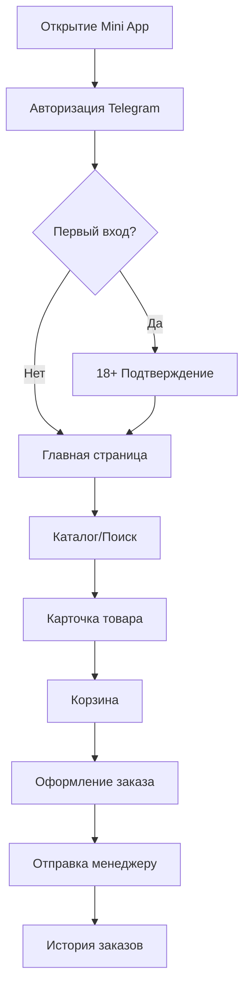

## 1. Product Overview
Telegram Mini App для магазина электронных сигарет и вейпов. Авторизация через Telegram WebApp, серверная корзина, каталог товаров с фильтрацией, система заказов и бонусов.

Целевая аудитория — пользователи Telegram, совершающие покупки вейпов и электронных сигарет. Продукт решает проблему быстрого и удобного заказа товаров через привычный интерфейс Telegram.

## 2. Core Features

### 2.1 User Roles
| Role | Registration Method | Core Permissions |
|------|---------------------|------------------|
| Пользователь | Автоматическая через Telegram WebApp | Просмотр каталога, корзина, заказы, бонусы |
| Администратор | Ручное добавление в БД | Управление товарами, заказами, баннерами |

### 2.2 Feature Module
Основные страницы Mini App:
1. **Главная**: навигация, баннеры, хиты недели, поиск, история заказов
2. **Каталог**: фильтры по категориям, брендам, цене, сортировка
3. **Карточка товара**: фото, описание, профиль вкуса, похожие товары
4. **Корзина**: список товаров, изменение количества, итог, скидки
5. **Оформление заказа**: создание заказа, выбор способа получения
6. **Профиль**: баланс бонусов, история заказов, статус пользователя
7. **18+ Подтверждение**: экран подтверждения возраста при первом входе

### 2.3 Page Details
| Page Name | Module Name | Feature description |
|-----------|-------------|---------------------|
| Главная | Навигация | Кнопки: Каталог, Акции, Корзина, Бонусы, Менеджер |
| Главная | Баннеры | Динамические баннеры с акциями и новинками |
| Главная | Хиты недели | Горизонтальный скролл популярных товаров |
| Главная | Поиск | Поиск по названию и описанию товаров |
| Главная | История заказов | Список последних 5 заказов с кнопкой "Повторить" |
| Каталог | Категории | Одноразки, Жидкости, Аксессуары, Другое |
| Каталог | Фильтры | Бренды, ценовой диапазон, новинки, скидки, вкусы |
| Каталог | Сортировка | По популярности, цене, новизне |
| Карточка товара | Галерея | Фото товара с возможностью увеличения |
| Карточка товара | Информация | Название, цена, описание, характеристики |
| Карточка товара | Действия | Кнопка "В корзину" с выбором количества |
| Карточка товара | Профиль вкуса | Шкалы 1-5 по параметрам вкуса (только чтение) |
| Карточка товара | Похожие товары | Горизонтальный список рекомендаций |
| Корзина | Список товаров | Карточки товаров с фото, названием, ценой, количеством |
| Корзина | Управление | +/- количество, удаление товара |
| Корзина | Итог | Подсчет стоимости, применение скидок и бонусов |
| Корзина | Промокод | Поле ввода и применение промокода |
| Оформление заказа | Создание | Генерация ID заказа, подготовка текста для менеджера |
| Оформление заказа | Отправка | Открытие чата менеджера через Telegram API |
| Профиль | Баланс | Отображение текущего баланса бонусов |
| Профиль | Статус | Уровень пользователя (обычный/VIP/ELITE) |
| Профиль | История | Список всех заказов с фильтрами по статусу |
| 18+ Подтверждение | Экран | Кнопка подтверждения возраста, сохранение флага |

## 3. Core Process

### Пользовательский поток:
1. Пользователь открывает Mini App в Telegram
2. Происходит автоматическая авторизация через WebApp
3. При первом входе — подтверждение 18+
4. Пользователь просматривает каталог, добавляет товары в корзину
5. Оформляет заказ, выбирает способ получения
6. Заказ отправляется менеджеру в Telegram
7. После доставки начисляются бонусы

## 4. User Interface Design

### 4.1 Design Style
- **Цвета**: Основной — #0088cc (Telegram blue), акцент — #ff6b6b, фон — #ffffff
- **Кнопки**: Скругленные (border-radius: 8px), с тенью при наведении
- **Шрифт**: system-ui, размеры: заголовки 18-20px, текст 14-16px
- **Лейаут**: Карточная система, верхняя навигация с иконками
- **Иконки**: Emoji + Material Icons, минималистичный стиль

### 4.2 Page Design Overview
| Page Name | Module Name | UI Elements |
|-----------|-------------|-------------|
| Главная | Навигация | Горизонтальные кнопки с иконками, 2 в ряд |
| Главная | Баннеры | Карусель 16:9, автопрокрутка каждые 5 сек |
| Главная | Хиты недели | Горизонтальный скролл карточек товаров |
| Каталог | Категории | Сетка иконок 2x2, круглые иконки |
| Каталог | Фильтры | Боковая панель, чекбоксы, range slider для цены |
| Карточка товара | Галерея | Слайдер фото, точки индикации, pinch-to-zoom |
| Карточка товара | Профиль вкуса | Горизонтальные шкалы с процентами |
| Корзина | Список | Карточки товаров, свайп для удаления |
| Профиль | Статус | Бейдж с цветовой индикацией уровня |

### 4.3 Responsiveness
Desktop-first подход с адаптацией под мобильные устройства. Оптимизация touch-взаимодействий: увеличенные кликабельные области, свайп-жесты в корзине.