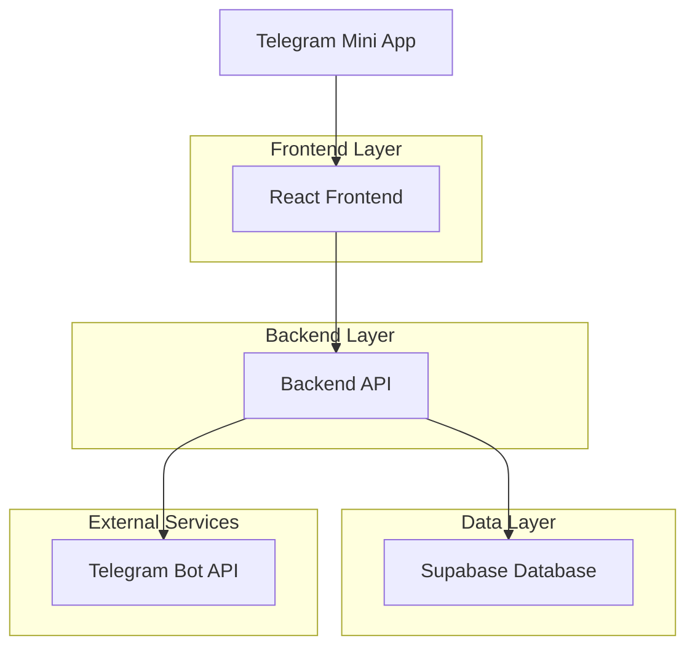
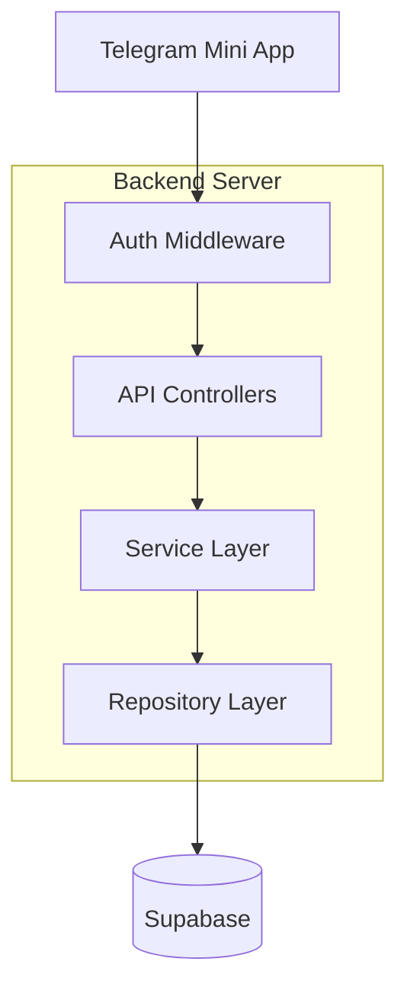
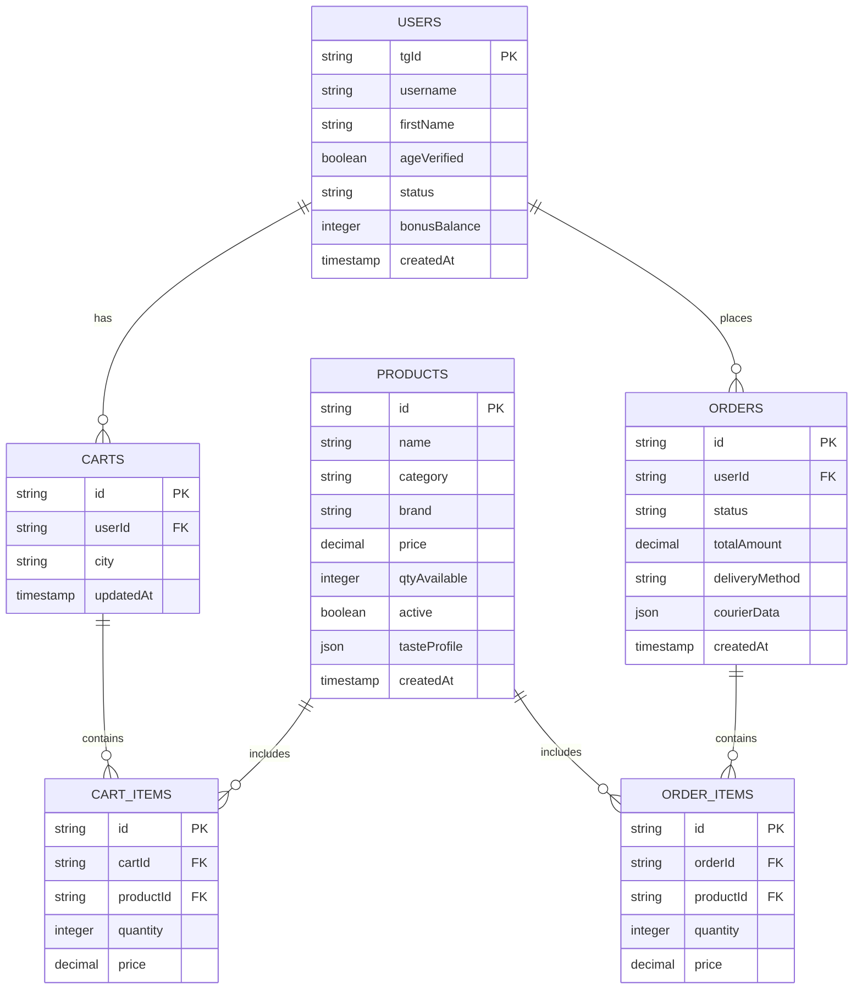

## 1. Architecture design



## 2. Technology Description
- Frontend: React@18 + Vite + Tailwind CSS
- Backend: Node.js + Express@4
- Database: Supabase (PostgreSQL)
- State Management: Zustand
- HTTP Client: Axios
- Telegram SDK: @twa-dev/sdk
- Initialization Tool: vite-init

## 3. Route definitions
| Route | Purpose |
|-------|---------|
| / | Главная страница с навигацией |
| /catalog | Каталог товаров с фильтрами |
| /product/:id | Карточка товара |
| /cart | Корзина пользователя |
| /checkout | Оформление заказа |
| /profile | Профиль и история заказов |
| /age-verify | Подтверждение 18+ |

## 4. API definitions

### 4.1 Authentication
```
POST /api/auth/verify
```

Request:
| Param Name | Param Type | isRequired | Description |
|------------|-------------|-------------|-------------|
| initData | string | true | Telegram WebApp initData |

Response:
| Param Name | Param Type | Description |
|------------|-------------|-------------|
| user | object | User data {tgId, username, firstName} |
| token | string | JWT token for API access |

### 4.2 Catalog
```
GET /api/catalog
```

Query Parameters:
| Param Name | Param Type | isRequired | Description |
|------------|-------------|-------------|-------------|
| city | string | true | Город доставки |
| category | string | false | Категория товара |
| brand | string | false | Бренд товара |
| price_min | number | false | Минимальная цена |
| price_max | number | false | Максимальная цена |
| discount | boolean | false | Только со скидкой |
| new | boolean | false | Только новинки |

### 4.3 Cart
```
POST /api/cart/add
POST /api/cart/remove
GET /api/cart
```

### 4.4 Orders
```
POST /api/order/create
POST /api/order/confirm
POST /api/order/payment
GET /api/orders/history
```

## 5. Server architecture diagram



## 6. Data model

### 6.1 Data model definition


### 6.2 Data Definition Language

Users Table:
```sql
CREATE TABLE users (
    tg_id VARCHAR(50) PRIMARY KEY,
    username VARCHAR(100),
    first_name VARCHAR(100),
    age_verified BOOLEAN DEFAULT false,
    status VARCHAR(20) DEFAULT 'regular',
    bonus_balance INTEGER DEFAULT 0,
    created_at TIMESTAMP DEFAULT NOW()
);

GRANT SELECT ON users TO anon;
GRANT ALL PRIVILEGES ON users TO authenticated;
```

Products Table:
```sql
CREATE TABLE products (
    id UUID PRIMARY KEY DEFAULT gen_random_uuid(),
    name VARCHAR(255) NOT NULL,
    category VARCHAR(50) NOT NULL,
    brand VARCHAR(100),
    price DECIMAL(10,2) NOT NULL,
    qty_available INTEGER DEFAULT 0,
    active BOOLEAN DEFAULT true,
    taste_profile JSONB,
    created_at TIMESTAMP DEFAULT NOW()
);

CREATE INDEX idx_products_category ON products(category);
CREATE INDEX idx_products_brand ON products(brand);
CREATE INDEX idx_products_active ON products(active);

GRANT SELECT ON products TO anon;
GRANT ALL PRIVILEGES ON products TO authenticated;
```

Cart and Order Tables:
```sql
CREATE TABLE carts (
    id UUID PRIMARY KEY DEFAULT gen_random_uuid(),
    user_id VARCHAR(50) REFERENCES users(tg_id),
    city VARCHAR(100) NOT NULL,
    updated_at TIMESTAMP DEFAULT NOW()
);

CREATE TABLE cart_items (
    id UUID PRIMARY KEY DEFAULT gen_random_uuid(),
    cart_id UUID REFERENCES carts(id),
    product_id UUID REFERENCES products(id),
    quantity INTEGER DEFAULT 1,
    price DECIMAL(10,2) NOT NULL
);

CREATE TABLE orders (
    id UUID PRIMARY KEY DEFAULT gen_random_uuid(),
    user_id VARCHAR(50) REFERENCES users(tg_id),
    status VARCHAR(50) DEFAULT 'buffer',
    total_amount DECIMAL(10,2) NOT NULL,
    delivery_method VARCHAR(50),
    courier_data JSONB,
    created_at TIMESTAMP DEFAULT NOW()
);

CREATE TABLE order_items (
    id UUID PRIMARY KEY DEFAULT gen_random_uuid(),
    order_id UUID REFERENCES orders(id),
    product_id UUID REFERENCES products(id),
    quantity INTEGER NOT NULL,
    price DECIMAL(10,2) NOT NULL
);

GRANT ALL PRIVILEGES ON carts, cart_items, orders, order_items TO authenticated;
```